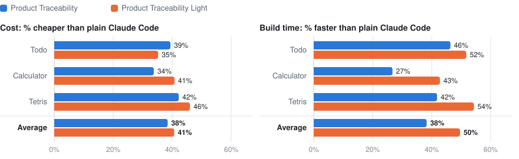

# Product Traceability for Claude Code

[](https://github.com/vmysla/agent-skill-product-traceability/actions/workflows/ci.yml)
[](LICENSE)
[](ab-study)
[](ab-study)

Product Traceability is a Claude Code skill for cross-session memory and product
requirements management. It increases engineering productivity, reduces AI token costs and
speeds up AI coding agents.

In a controlled A/B test on three apps, compared with plain Claude Code on Claude Opus 5
(1M context):

- **Product Traceability** was **38% cheaper and 38% faster**.
- **Product Traceability Light**, the six distilled working principles on their own, was
  **41% cheaper and 50% faster**.
- Neither version broke a single feature that had worked before.

The idea came from my own work. Looking back at my sessions in May 2026, I estimated that
keeping a product record made them
[about 44% more productive](https://vmysla.substack.com/p/ai-coding-skill-that-may-cut-your-ai-coding-costs-by-30-45-percent).
That was an estimate. The numbers above come from a controlled test.

It remembers what you asked for, what was built, what was decided and what was rejected,
across every session. Hooks write that record, so the agent never spends a turn on
paperwork. Every new session starts with a short summary of it, and a few working rules
keep the agent on the work itself.

## Contents

- [Results](#results)
- [Which version should I use?](#which-version-should-i-use)
- [Install](#install)
- [Where the idea came from](#where-the-idea-came-from)
- [Reproduce the study](#reproduce-the-study)
- [Versions](#versions)
- [Contributing](#contributing)
- [License](#license)

## Results

Claude Code built three small web apps (a todo list, a calculator and a tetris game) from
ten rounds of changing requirements, three times with each setup. Every round was a fresh
session, so nothing carried over except the code, git, Claude Code's own memory and the
plugin. The requirements changed the way real products do: new features, a conflict with
an earlier decision, a partial reversal, a bug report, and requests that relied on earlier
choices without restating them.

Read the full paper:
[*Product Traceability for Coding Agents: A Controlled Evaluation Across Evolving Web Applications*](ab-study/results/product-traceability-for-coding-agents.pdf)
(PDF).

<picture>
  <source media="(prefers-color-scheme: dark)" srcset="docs/images/savings-dark.svg">
  
</picture>

Averaged over the three apps:

| | Cost | Build time | Checks passed |
|---|---|---|---|
| Plain Claude Code | baseline | baseline | 258 of 258 |
| **Product Traceability** | **38% cheaper** | **38% faster** | 256 of 258 |
| **Product Traceability Light** | **41% cheaper** | **50% faster** | 257 of 258 |

No run had a regression, a timeout or an error. The three missed checks were all
requirements added in the last round. All runs used Claude Code 2.1.269 with Claude Opus 5.

<details>
<summary><b>Per-app numbers</b></summary>

Mean of three runs. Cost is what Claude Code reported for the whole build, extraction
included. Build time is wall-clock time for all ten sessions, run one at a time.

| App | Setup | Cost per build | Build time | Checks passed |
|---|---|---|---|---|
| Todo | Plain Claude Code | $4.73 | 13.2 min | 72 of 72 |
| Todo | Product Traceability | $2.86 | 7.1 min | 72 of 72 |
| Todo | Light | $3.06 | 6.4 min | 72 of 72 |
| Calculator | Plain Claude Code | $5.67 | 16.5 min | 99 of 99 |
| Calculator | Product Traceability | $3.76 | 12.1 min | 97 of 99 |
| Calculator | Light | $3.36 | 9.4 min | 99 of 99 |
| Tetris | Plain Claude Code | $6.46 | 18.2 min | 87 of 87 |
| Tetris | Product Traceability | $3.73 | 10.6 min | 87 of 87 |
| Tetris | Light | $3.49 | 8.3 min | 86 of 87 |

The full table, one row per run, is in
[`ab-study/results/2026-09-replication`](ab-study/results/2026-09-replication/summary.md).

</details>

How it works, why it is faster, and the limits of the study are in
[docs/details.md](docs/details.md).

## Which version should I use?

| | **Product Traceability** | **Product Traceability Light** |
|---|---|---|
| What it is | Hooks, a product record, a memory summary and working rules | Six working rules in `CLAUDE.md` |
| Keeps requirements, decisions and rejected options | Yes, in `docs/product-traceability/` | No |
| Next session knows the rules in force | Yes, from the memory summary | Only what the code shows |
| Measured vs plain Claude Code | 38% cheaper, 38% faster | 41% cheaper, 50% faster |
| Moving parts | Five hook events, Python helpers, one small model call per changed turn | None |
| Best for | Products that evolve over weeks, change hands, or need an audit trail | Prototypes, utilities, experiments and other short-lived work |

Light was fastest on these small apps because it has no hooks to run. It also has no
memory of decisions beyond the code: in two of three todo runs it moved code into a second
file even though an earlier round had said to keep one file. Product Traceability kept that
rule in every run.

## Install

```bash
git clone https://github.com/vmysla/agent-skill-product-traceability.git
cd agent-skill-product-traceability

./install.sh            # Product Traceability
./install.sh --light    # or Product Traceability Light
```

That's it. The installer sets up every project on your machine, and re-running it is safe.
Installing one version removes the other, and removes version 1 if you have it.

```bash
./uninstall.sh          # removes both versions; records in your projects stay
```

**Requirements:** macOS or Linux, `bash`, `python3`, `git`, and the `claude` CLI on your
PATH. Projects must be git repositories. Standing checks, if you use them, run with `node`.
Tested with Claude Code 2.1.269 and Claude Opus 5.

**Check it works:** open any git project in Claude Code and ask for a change. When the turn
ends, `docs/product-traceability/` appears in the project.

<details>
<summary><b>Install for one project only</b></summary>

- **Light:** copy [`light/CLAUDE.md`](light/CLAUDE.md) into the project root.
- **Product Traceability:** copy `skill/` to `.claude/skills/`, `hooks/` to `.claude/hooks/`
  and `bin/` to `.claude/bin/`, then write [`project-settings.json`](project-settings.json)
  to `.claude/settings.json` with `{HOOKS_DIR}`, `{BIN_DIR}` and `{SKILL_DIR}` replaced by
  absolute paths. The study runner does exactly this for every test project
  ([`ab-study/runner/run_arm.py`](ab-study/runner/run_arm.py)).

</details>

## Where the idea came from

The plugin started as a habit. While building ten projects in three months, with fast
prototypes and frequent pivots, I kept starting fresh codebases and re-explaining the same
product details to the AI every time. Whatever we worked out during a session was gone by
the next one. So I asked the agent to keep four files in the repository: a living
requirements document, a change log, a decisions log and a traceability matrix. I wrote up
the idea and my first estimate, about 44% more productive sessions, in May 2026:
[*AI Coding Skill That May Make Your Coding Sessions +44% More Productive*](https://vmysla.substack.com/p/ai-coding-skill-that-may-cut-your-ai-coding-costs-by-30-45-percent).

> The expensive part is not just paying for tokens. The expensive part is making
> high-cost agents repeatedly rediscover context your repo could have remembered for free.

That estimate came from looking back at my own sessions, not from a controlled test. When I
ran one, version 1 turned out to cost 2 to 2.9 times as much as plain Claude Code: the agent
spent its turns maintaining the files. Version 2 keeps the same four files but moves all of
the bookkeeping into hooks. It is the version measured in [Results](#results).

## Reproduce the study

Everything behind the results is in [`ab-study/`](ab-study): the task specs, the graders,
the exact builds that were tested, the runner, and the raw sessions of all 27 runs.

```bash
# Recompute every published number from the raw sessions (Python 3 only)
python3 ab-study/runner/collect.py --data ab-study/results/2026-09-replication
```

Rerunning all 27 builds takes about 5 hours and $110 of Claude usage. The
[study README](ab-study/README.md) explains setup, safety and how to compare your numbers.

## Versions

- **2.0.0** (September 2026): hooks keep the record; Product Traceability Light; the A/B
  study. See [CHANGELOG.md](CHANGELOG.md).
- **1.0.0** (April 2026): the agent kept four Markdown files itself. It is in the git
  history. In the controlled test it cost 2 to 2.9 times as much as plain Claude Code,
  which led to version 2.

## Contributing

Issues and pull requests are welcome. Please read [CONTRIBUTING.md](CONTRIBUTING.md) and the
[code of conduct](CODE_OF_CONDUCT.md). To report a security problem, see
[SECURITY.md](SECURITY.md).

This project is built with Product Traceability, but its own records (requirements,
decisions, the traceability matrix, the change log and session logs) are not published
here. They are kept in a private repository, `product-tracebility-ab-testing`, owned by
Vlad Mysla. If you would like to contribute and need access to those records, write to
Vlad at [vlad.mysla@gmail.com](mailto:vlad.mysla@gmail.com).

## License

MIT. See [LICENSE](LICENSE).
