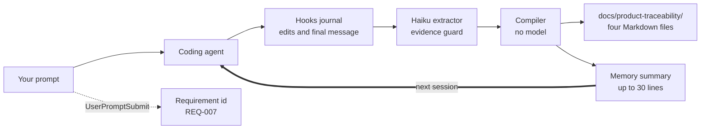
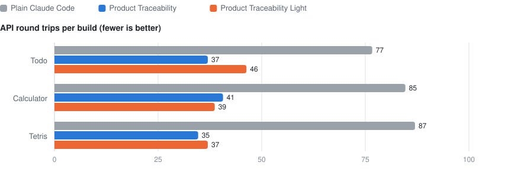

# Product Traceability in detail

More on how the plugin works, what it records, the rules it gives the agent, why it is
faster, what it costs to run, and the limits of the study. For an overview and install
steps, see the [README](../README.md).

## Contents

- [How it works](#how-it-works)
- [What gets recorded](#what-gets-recorded)
- [The working rules](#the-working-rules)
- [Why it is faster](#why-it-is-faster)
- [Cost, privacy and configuration](#cost-privacy-and-configuration)
- [Limits](#limits)
- [FAQ](#faq)

## How it works

The agent does the work; hooks keep the record. Nothing the agent does is interrupted, and
the agent never opens a record file.



**Write path.** Each prompt gets a requirement id. Edits and the final message are
journaled. After a turn that changed code, one small model call reads bounded excerpts of
the prompt, the final message and the diff, and proposes requirement status and at most two
decisions. A deterministic compiler, with no model involved, then rebuilds
`requirements.md`, `decisions.md`, `traceability-matrix.md` and `change.log` in
`docs/product-traceability/`, and the memory summary.

**Read path.** Claude Code loads the project's memory file at the start of every session.
Product Traceability writes its summary there: the files, a map of the source, requirement
statuses, recent changes and the rules in force. Each rule links to a topic file with the
full reasoning, which the agent opens only when it needs it.

| Hook | When it runs | What it does |
|---|---|---|
| `SessionStart` | a project's first session | prints the working rules; later sessions get them from memory |
| `UserPromptSubmit` | every prompt | assigns a requirement id, one line of context |
| `PostToolUse` | after edits and shell commands | journals the change and runs `check/`, in the background |
| `Stop` | end of each turn | extraction, evidence guard, compile, memory summary |
| `SessionEnd` | end of the session | catches anything the last turn missed, with no model call |

Two safeguards keep the record honest:

- **Evidence guard.** A decision is stored only if its evidence is a word-for-word quote
  from the agent's final message or the diff. The extraction model can summarize; it
  cannot invent.
- **Red check, reported once.** If a standing check in `check/` fails, the Stop hook tells
  the agent once before the turn ends, and never nags twice.

## What gets recorded

| File | What it holds |
|---|---|
| `docs/product-traceability/requirements.md` | every request, numbered, with its status and linked decisions |
| `docs/product-traceability/decisions.md` | what was chosen, why, what was rejected, and the quote that proves it |
| `docs/product-traceability/traceability-matrix.md` | each requirement mapped to the functions that implement it |
| `docs/product-traceability/change.log` | one line per turn, with the diff summary |
| Claude Code memory (`MEMORY.md`) | the summary the next session starts with, plus one topic file per decision |
| `.claude/pr/` | local working state: the journal, check results and the cost of every extraction call |

In the study, every completed requirement was linked to the code that implements it, and
the summary was about a tenth of the size of the record it summarized.

<details>
<summary><b>Example: a decision</b></summary>

From one of the todo runs in the study:

```markdown
## DEC-003 - Ordering rule: completed todos below active

- REQ: REQ-002
- Status: accepted
- Chose: Completed todos always appear BELOW all active todos. Within each group,
  todos stay in insertion order (oldest first).
- Why: The prompt explicitly states this as a rule to keep for the rest of the project.
- Evidence: "Completed todos always appear BELOW all active todos. - Within each group,
  todos stay in insertion order (oldest first)."
```

</details>

<details>
<summary><b>Example: the traceability matrix</b></summary>

Trimmed from the same run:

```markdown
| REQ     | Status | Title                  | Implementation (file:function)              |
|---------|--------|------------------------|---------------------------------------------|
| REQ-003 | done   | Add due dates          | index.html:isOverdue, index.html:todayLocal |
| REQ-005 | done   | Sort todos by priority | index.html:orderedTodos                     |
| REQ-008 | open   | Bug report from a user | -                                           |
```

REQ-008 is a bug report that contradicted a recorded date rule. The agent checked it
against the rule, reported that it could not be reproduced, and changed nothing.

</details>

<details>
<summary><b>Example: the memory summary the next session starts with</b></summary>

Trimmed from the same run, shown with the released names:

```markdown
# Product traceability (maintained by hooks)
- Files: index.html. This list is current; do not list the directory.
- Source map: index.html (401 lines) - functions: loadTodos@L120, saveTodos@L130,
  orderedTodos@L146, isOverdue@L172, render@L195, addTodo@L283, ...
- Requirements: REQ-001 done | REQ-002 done | ... | REQ-008 open | REQ-009 done
- Recent changes (newest first):
  - REQ-010: I added one new shortcut: `/` now jumps to the search box, ...
- Rules in force (every change must honour these):
  - DEC-001 Single file constraint: ONE file: index.html with inline CSS and JS, ... [why](dec-001-....md)
  - DEC-003 Ordering rule: Completed todos always appear BELOW all active todos. ... [why](dec-003-....md)
  - DEC-005 Date storage and overdue rules: Store due dates as plain YYYY-MM-DD strings; ... [why](dec-005-....md)
- Working rules:
  1. Mark implementing code with `// [REQ-nnn]` ...
```

</details>

## The working rules

Six rules do most of the work. They tell the agent to:

1. **Read the source once** with the Read tool, instead of paging through it or listing
   directories.
2. **Keep checks small:** a few assertions on pure functions, never a test harness built
   inside a task.
3. **Send all edits in one message** and verify once, at the end.
4. **Trust a stated rule over a contradicting report:** if the code follows the rule, say
   the report cannot be reproduced and stop.
5. **End with three short lines:** what was chosen, why, and what was rejected.
6. **Keep stated rules** until a prompt cancels them, and never drop one silently.

Light installs exactly these six: [`light/CLAUDE.md`](../light/CLAUDE.md). Product
Traceability words them for its memory summary and adds three more, about marking code with
requirement ids and about the record: [`bin/working-rules.md`](../bin/working-rules.md).

## Why it is faster

The saving comes from turns, not from smaller prompts. Plain Claude Code needed about 80
API round trips per build. Product Traceability needed 55% fewer and Light 51% fewer, about
40 each. Output tokens fell by 34% and 45%, counting every model involved, including
Product Traceability's extraction calls.

<picture>
  <source media="(prefers-color-scheme: dark)" srcset="images/round-trips-dark.svg">
  
</picture>

The transcripts show where the extra turns went. In the todo builds made while developing
the plugin, plain Claude Code spent, per build:

- **about 25 runs of node or a browser**, re-checking its work after every edit. With
  Product Traceability: 3.
- **about 11 calls** listing files and paging through the source to find its way. With
  Product Traceability: almost none.
- **about 11 calls** digging through git history to work out why the code is the way it is.
  With Product Traceability: almost none.
- **about 7 calls** writing and reading throwaway test scripts. With Product Traceability:
  almost none.

The study tested each version as a whole, so it does not say which rule or hook removed
which calls. Light's result suggests the working rules do much of it. The product record is
built for what small apps cannot show: products that live for months and change hands.
That is why there are two versions.

## Cost, privacy and configuration

**What it costs to run.** One Haiku call per turn that changes code, about two cents each.
In the study that came to $0.13 to $0.18 for a ten-session build, already included in the
results. The call runs at the end of the turn and added 1.4 to 2.0 minutes to a build.

**What leaves your machine.** Nothing beyond what Claude Code already sends. The extraction
call goes through your own `claude` CLI and account, with no tools and no project settings.
It receives bounded excerpts: up to 2,000 characters of the prompt, 4,000 of the final
message and 12,000 of the diff, plus short summaries of existing requirements and decisions.

**Settings.**

| Setting | Default | What it does |
|---|---|---|
| `PR_EXTRACT_MODEL` | `claude-haiku-4-5-20251001` | model used for extraction |
| `PR_EXTRACT_BUDGET_USD` | `0.25` | spending cap for one extraction call |
| `CLAUDE_CONFIG_DIR` | `~/.claude` | where the installer and hooks find Claude Code's config |
| `autoMemoryDirectory` | Claude Code default | respected when writing the memory summary |

## Limits

- **Small apps, one model.** The study used three single-file web apps of a few hundred
  lines and Claude Opus 5. Large, multi-file codebases have not been tested yet, and that
  is where a product record should matter most.
- **Quality was near the ceiling.** Every setup passed at least 98% of checks, so the study
  shows lower cost and time without a measurable quality loss, not better code.
- **Configurations, not components.** Each version was tested as a whole. The study does not
  say how much of the saving comes from each rule or hook.
- **No requirement-to-test links.** Requirements are linked to code. Linking them to tests
  was out of scope.
- **Three runs per setup.** Enough to see a consistent effect, not to pin down its exact
  size.

## FAQ

<details>
<summary><b>Does the agent read or edit the record?</b></summary>

No. It reads the memory summary Claude Code already loads, and opens a decision's topic
file when it needs the reasoning. In all 9 Product Traceability runs of the study, the main
agent opened a record file zero times.

</details>

<details>
<summary><b>Should I commit <code>docs/product-traceability/</code>?</b></summary>

Commit it if you want the product history to live with the code and be reviewed like code.
The files are regenerated by the hooks, so edit them by asking the agent, not by hand.
`.claude/pr/` is local working state.

</details>

<details>
<summary><b>How do I change or cancel a recorded rule?</b></summary>

Say so in a prompt. Rules stay in force until a prompt cancels them, and the next extraction
records the change.

</details>

<details>
<summary><b>What happens if the extraction call fails?</b></summary>

Nothing breaks. The turn finishes, the failure is logged in `.claude/pr/costs.jsonl`, and the
next turn carries on. In the study, 1 of 81 calls failed.

</details>

<details>
<summary><b>Does it work with Codex, Cursor or other agents?</b></summary>

The hooks are built for Claude Code. The records are plain Markdown, so any tool or person
can read them, and Light's six rules work as instructions in any agent that reads a
`CLAUDE.md` or similar file.

</details>

<details>
<summary><b>How is this different from Claude Code's built-in memory?</b></summary>

Built-in memory holds whatever notes the agent chooses to write, when it chooses to. In the
study, plain Claude Code wrote notes in 6 of 9 runs. Product Traceability writes a structured
record on every changed turn: numbered requirements, decisions with rejected alternatives
and quoted evidence, and links to the code.

</details>
